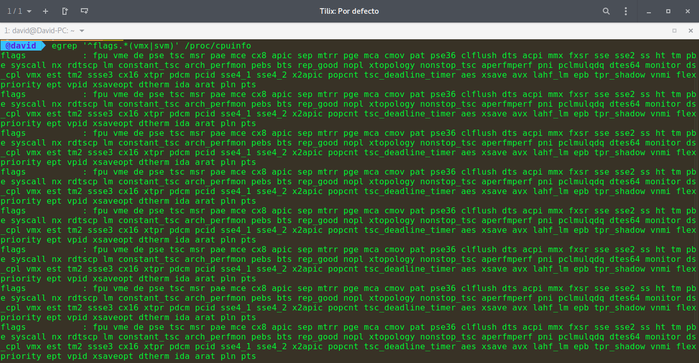
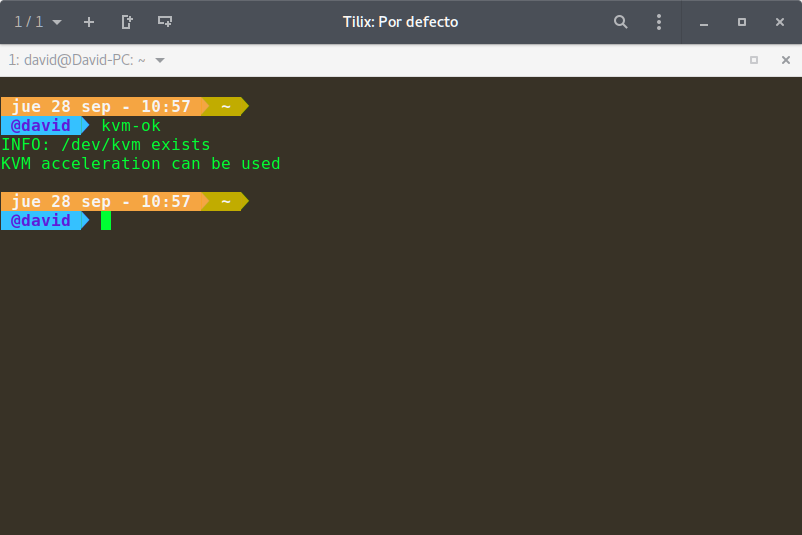
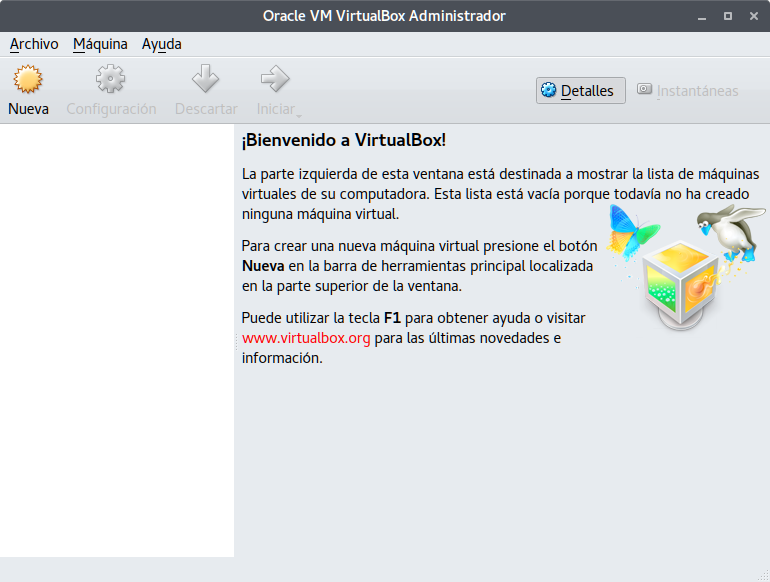

# Ejercicios Tema 1
---
## Ejercicio 1:

### Consultar en el catálogo de alguna tienda de informática el precio de un ordenador tipo servidor y calcular su coste de amortización a cuatro y siete años. [Consultar este artículo en Infoautónomos sobre el tema](http://infoautonomos.eleconomista.es/consultas-a-la-comunidad/988/).

El servidor que he escogido para calcular su coste de amortización es [este](https://www.pccomponentes.com/hp-proliant-ml30-gen9-intel-xeon-e3-1220v5-8gb-2tb). Su precio es de 815,59€, sin IVA (base imponible) es de 674,05€.

**Amortización a 4 años**

Se amortiza un 25% de la base imponible por cada año, es decir 168,5125€ anuales.

**Amortización a 7 años**

Se amortiza un 14,29% de la base imponible por cada año, es decir 96,293€ anuales.

---
## Ejercicio 2:

### Usando las tablas de precios de servicios de alojamiento en Internet “clásicos”, es decir, que ofrezcan Virtual Private Servers o servidores físicos y de proveedores de servicios en la nube, comparar el coste durante un año de un ordenador con un procesador estándar (escogerlo de forma que sea el mismo tipo de procesador en los dos vendedores) y con el resto de las características similares (tamaño de disco duro equivalente a transferencia de disco duro) en el caso de que la infraestructura comprada se usa sólo el 1% o el 10% del tiempo.

Vamos a comparar entre [VPS Hostinger Plan 1](https://www.hostinger.es/servidor-vps) y [Amazon EC2 t2.micro](https://aws.amazon.com/es/ec2/pricing/)

Las características de ambos son:

**Amazon EC2 t2.micro**
* vCPU: 1
* ECU: Variable
* Memoria: 1GiB
* Almacenamiento de la instancia(GB): Solo EBS
* Precio: $0.014 por hora

**VPS Hostinger Plan 1**

* 1GB de RAM
* 2.4 GHz de CPU
* 20 GB de Almacenamiento
* 1000 GB de ancho de banda
* Precio 6.99€/mes

**Coste usando solo un 1%:**

**Hostinger**: 6.99€ * 12 meses = 83.88€ al año

**Amazon**: (0.014$/hora * 24 horas * 365 dias) * 0.01% = 1.2264$ al año

**Coste usando solo un 10%:**

**Hostinger**: 6.99€ * 12 meses = 83.88€ al año

**Amazon**: (0.014$/hora * 24 horas * 365 dias) * 0.01% = 12.264$ al año

---
## Ejercicio 3:

### En general, cualquier ordenador con menos de 5 o 6 años tendrá estos flags. ¿Qué modelo de procesador es?

Mi procesador es Intel® Core™ i7-2670QM CPU @ 2.20GHz × 8

### ¿Qué aparece como salida de esa orden?

### Si usas una máquina virtual, ¿qué resultado da?
Dice que no está activa la virtualizacion.

### ¿Y en una Raspberry Pi o, si tienes acceso, [el procesador del móvil](https://stackoverflow.com/questions/26239956/how-to-get-specific-information-of-an-android-device-from-proc-cpuinfo-file)?
Dice que no está activa la virtualizacion.

---
## Ejercicio 4:

### Comprobar si el núcleo instalado en tu ordenador contiene este módulo del kernel usando la orden kvm-ok.

### Instalar un hipervisor para gestionar máquinas virtuales, que más adelante se podrá usar en pruebas y ejercicios.

He instalado virtualbox

---
## Ejercicio 5:

### Darse de alta en servicios de nube usando ofertas gratuitas o cupones que pueda proporcionar el profesor.

Me he dado de alta en [Google Cloud Platform](https://cloud.google.com/?hl=es) y he obtenido un bono de 300$.

---
## Ejercicio 6:

### Darse de alta en una web que permita hacer pruebas con alguno de los sistemas de gestión de nube anteriores.
