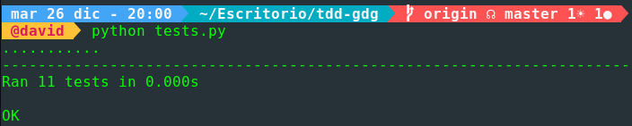

# Ejercicios Tema 2

## Ejercicio 1:

### Descargar y ejecutar las pruebas de alguno de los proyectos anteriores, y si sale todo bien, hacer un pull request a este proyecto con test adicionales, si es que faltan (en el momento que se lea este tema).

Realizo un clone del repositorio [tdd-gdg](https://github.com/JJ/tdd-gdg) y ejecuto los test.



Ahora añado una funcion para comprobar si un número es par o impar y sus correspondientes test.

```
def odd(number):
    if(number % 2 == 0):
        return True
    else:
        return False


def even(number):
    if(number % 2 != 0):
        return True
    else:
        return False


def test_odd(self):
    self.assertTrue(odd(2), "El numero 2 es par")
    self.assertTrue(not odd(3), "El numero 3 no es par")

def test_even(self):
    self.assertTrue(even(3), "El numero 3 es impar")
    self.assertTrue(not even(2), "El numero 2 no es impar")

```

--------------------------------------------------------------------------------

## Ejercicio 2:

### Para la aplicación que se está haciendo, escribir una serie de aserciones y probar que efectivamente no fallan. Añadir tests para una nueva funcionalidad, probar que falla y escribir el código para que no lo haga (vamos, lo que viene siendo TDD).

Realizado en el Ejercicio 1.

--------------------------------------------------------------------------------

## Ejercicio 3:

### Convertir los tests unitarios anteriores con assert a programas de test y ejecutarlos desde `mocha`, usando descripciones del test y del grupo de test de forma correcta. Si hasta ahora no has subido el código que has venido realizando a GitHub, es el momento de hacerlo, porque lo vas a necesitar un poco más adelante.

--------------------------------------------------------------------------------

## Ejercicio 4:

### Instalar alguno de los entornos virtuales de `node.js` (o de cualquier otro lenguaje con el que se esté familiarizado) y, con ellos, instalar la última versión existente, la versión `minor` más actual de la 4.x y lo mismo para la 0.11 o alguna impar (de desarrollo).

--------------------------------------------------------------------------------

## Ejercicio 5:

### Como ejercicio, algo ligeramente diferente: una web para calificar las empresas en las que hacen prácticas los alumnos.

### Las acciones serían

```
- Crear empresa
- Listar calificaciones para cada empresa
- Crear calificación y añadirla (comprobando que la persona no la haya añadido ya)
- Borrar calificación (si se arrepiente o te denuncia la empresa o algo)
- Hacer un ránking de empresas por calificación, por ejemplo
- Crear un repositorio en GitHub para la librería y crear un pequeño programa que use algunas de sus funcionalidades.
```

### Si se quiere hacer con cualquier otra aplicación, también es válido.

--------------------------------------------------------------------------------

## Ejercicio 6:

### Ejecutar el programa en diferentes versiones del lenguaje. ¿Funciona en todas ellas?

--------------------------------------------------------------------------------

## Ejercicio 7:

### Crear una descripción del módulo usando `package.json`. En caso de que se trate de otro lenguaje, usar el método correspondiente.

--------------------------------------------------------------------------------

## Ejercicio 8:

### Automatizar con `grunt`, `gulp` u otra herramienta de gestión de tareas en Node la generación de documentación de la librería que se cree usando `docco` u otro sistema similar de generación de documentación. Previamente, por supuesto, habrá que documentar tal librería.

--------------------------------------------------------------------------------

## Ejercicio 9:

### Haced los dos primeros pasos antes de pasar al tercero.
